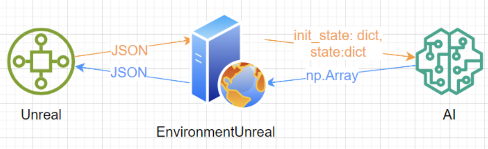

# Car physics simulator

## Introduction

There are two options for simulating car physics to train AI models.

1) Physics simulation takes place in the **Unreal engine**, which interacts with a python script.
You should select EnvironmentUnreal as the environment 
(see example in `NeuralPilotAI/src/run_unreal.py`). 
To run Unreal and python scripts you need to start `run_all.cmd`.
It is worth first running `NeuralPilotAI/setup.cmd` which will install the necessary python libraries.

2) Physics simulation occurs directly in Python - **Pygame Environment**.
You don't need Unreal for this. Physics is significantly faster, but not as realistic.
The Environment class should be selected as the environment.
Various launch options are possible (see functions main and main_game in `NeuralPilotAI/src/run_pygame.py`
and `run_pygame.py` run it directly).

The logic of interaction with the environment is described in the agent class.
This class should have methods:
```python
    reset(init_state, state) # getting the initial static state and current state of environment
    step (state, reward)     # the agent receives current state and reward (can be ignored)
```
The last method should return actions as a numpy array `(N,2)`,
where `N` is the number of agents, 2 actions (gas/brake and steering wheel turn) 
with values for each in the range `[-1..1]`.


Examples of agents can be found in the folder `NeuralPilotAI/src/ai/steps`:
* `ai_random.py` - performs random actions
* `ai_greedy.py` - greedy movement towards the goal

## Data Format

The environment transmits to the agent the initial state (about static data),
the current state of the environment and the reward:
```python
init_state = {
    'space':   np.array (3,),    # dimensions in meters of space
    'n_cars':  int,              # number of cars (any kind)
    'ai_kind': int,              # kind of type current AI
    'kind':    np.array (N,),    # type of each car for different AI (kind==0 - human)
    'string':  np.array (M,2,3), # walls positions L(x,y,z), R(x,y,z)
}

state = {
    'space': np.array (3,)       # dimensions in meters of space
    'dt':    float               # time since previous states update
    'pos':   np.array (N,3)      # position vectors of the center of mass of all cars in meters
    'vel':   np.array (N,3)      # velocity vectors of the center of mass of all cars in m/sec
    'dir':   np.array (N,3)      # car orientation unit vector (from the center of mass forward)
    'wheels':np.array (N,2)      # turning angles of the front wheels of cars
    'target_pos': np.array (N,3) # position of target points
    'target_vel': np.array (N,3) # velocity of target points
}

reward: np.array(N,)             # real numbers for each machine (achieving a target, etc.)
```

## Unreal Environment

### Introduction

The EnvironmentUnreal class is an adapter between the Unreal Engine environment and AI models.
It is a server that connects to Unreal Engine via WebSockets and waits for Unreal commands.

Communication between Unreal and the Adapter occurs by sending a JSON string, which will be converted into a data transfer format for the AI model.
The same goes for the model response - the adapter converts the numpy array into JSON, which Unreal understands.

<center>
 
</center>

Currently, the server is designed for one WebSocket connection and at the same time supports working with several AIs.
The entire work of the adapter lies in the process(ws) method, which receives messages via WebSockets, converts data, sends data to AI and returns a response to Unreal.

When you start or restart the game, an extended JSON will be sent, which includes the `init_state` data. If there is an `init_state` in the request, all AIs are `reset`.

### Run the Unreal

Since the Unreal environment is a separate environment that, independently of AI, deals with physics calculations and frame rendering, the number of machines, as well as the correspondence of AI to machines, is specified in the Unreal config.
The config is located along the path (for quick access you can run config.cmd from the project root):
```
~\AiCar vX\WindowsNoEditor\AICar\Saved\Config\WindowsNoEditor\Game.ini
```
A section for setting up ai - ai_cars was added to the config.
```
[ai_cars]
count=3
AI_0=Type=bus,Color=red,Num=1
AI_1=Type=car,Color=yellow,Num=1
AI_2=Type=car,Color=green,Num=1
AI_3=Type=car,Color=gray,Num=1
AI_4=Type=car,Color=dark_blue,Num=1
AI_5=Type=car,Color=metal,Num=1
AI_6=Type=car,Color=glass,Num=1
AI_7=Type=car,Color=tires,Num=1
AI_8=Type=car,Color=blue,Num=1
```
where:
* `count` is the number of active AIs. (The number of active AIs must correspond to the number of AIs in the adapter. `EnvironmentUnreal([AI1(), AI2(), AI3()])`=> `env_ai_count == 3`) If the number does not match, then part of the AI will not work. (If `count > env_ai_count`, then cars without AI will be created in Unreal, and if `count < env_ai_count`, then AI from EnvironmentUnreal will not be tied to cars)
* `AI_X` - AI parameters, where X is the AI serial number. In general, you can define as many AI as you like. In a particular case - 9, because 9 different colors are implemented and when determining the number of AI > 9, some colors will be repeated.

Each AI has text parameters:
* `Type` - ai type. Designed to identify AI not by number, but by type. Currently not in use.
* `Color` - one of 9 defined colors.
* `Num` - number of machines for this AI. It is important to control the total number of cars and the number of cars indicated in the AI, because if the total number is less, then not all AIs will work. For example, if the total number of machines = 3 and AI_0 is set to 5, then only 3 AI_0 machines will be created. No other AI_X will be created.

To run the game, you need to run the game server and client separately.
The server is located at the path: `~\NeuralPilotAI\src\run_unreal.py`
The game client is located at: `~\AiCar vX\WindowsNoEditor\AICar.exe`
(for a quick launch, you can use the run_all.cmd file in the root)

### Game process

During the network training, a synchronous operating mode was implemented between Unreal and EnvironmentUnreal. 
This means that after Unreal has sent state data to the server, it hangs and waits for a response.
In addition, if at least 1 AI is specified in `Game.ini`, then upon startup Unreal will “freeze” before connecting to the server.
To close the game if it freezes, you need to press ~ and enter exit.

## Pygame Environment

When working with a simulator in Python (without Unreal),
it is possible to configure various environment parameters:
* `ai (dict)`: Agent dictionary in the format `{ 'name': {'ai': AI(), 'num': 5}, ...}`. ai may be missing (in game mode `ai=None`). There can be several agents; `'name'` is an arbitrary string; `AI()` - AI instance; `'num'` is the number of his cars. If the first agent is `{ 'human': {'ai': None, 'num': 1}, ...}` - then this is keyboard control (in game mode).
* `n_cars (int)`: Number of cars. If ai != None is ignored. The first car (index=0) is considered the player's car (pink), although the AI may ignore this
* `w,h,d (float)`: Dimensions of space in meters (height d is ignored for now)
* `mt2px (float)`: Converting meters to pixels. If w,h=60,40 and mt2px=10 - window size = 600x400px
* `level (int=0,1)` - difficulty level (0-empty space, except borders; 1-there are fences inside the space)

After creating the environment, you can call the `env.set_params` function (see example in function main in `run_pygame.py`) with the arguments:

* `car_collision        (bool=True):`  handle car collisions
* `segment_collision    (bool=True):`  handle collisions with segments (inside space)
* `all_targets_are_same (bool=False):` the coordinates of all targets are the same
* `show_target_line     (bool=False):` show line from car to target
* `show_actions         (bool=False):` show current car actions

To start the simulation, run `env.run` with parameters:
* `draw_fps (float = 40)`: frames per second for drawing the environment
* `phys_fps (float = 40)`: frames per second for physics (if speed_up then virtual)
* `speed_up (bool = True)`: to accelerate physics or not; if True, then the equations will be solved for time dt = 1/phys_fps, but in computer time this will be done as quickly as possible
* `steps    (int = 1000)`: number of calls to the step function of AI (same as the number of calls to phys)


If AI returns actions of dimension (N,5), then the first 2 actions are interpreted as gas and steering,
the remaining 3 are components of the vector that is drawn when the show_actions=True.
You can, for example, write the direction from the Decision Making module into this vector.

In addition to standard keyboard arrow control (see main_game function), the pygame environment supports the following keys:
* `Esc` - exit
* `p`   - pause on/off (physics stops)
* `i`   - enable/disable action information (show_actions     = True/False)
* `t`   - enable/disable line to target     (show_target_line = True/False)
* `tab` - switch the camera (only in the game mode - see main_game)

The window title displays:
* speed (in m/sec and km/h) of the first (zero) car
* fps of physics work (with `speed_up=True` of the `env.run` function it can be large).
* time and number of physics simulation steps (with `speed_up=True` of the `env.run` changes quickly)
* targets - number of targets collected by each type of AI
* average time to reach the target for each type of AI per agent